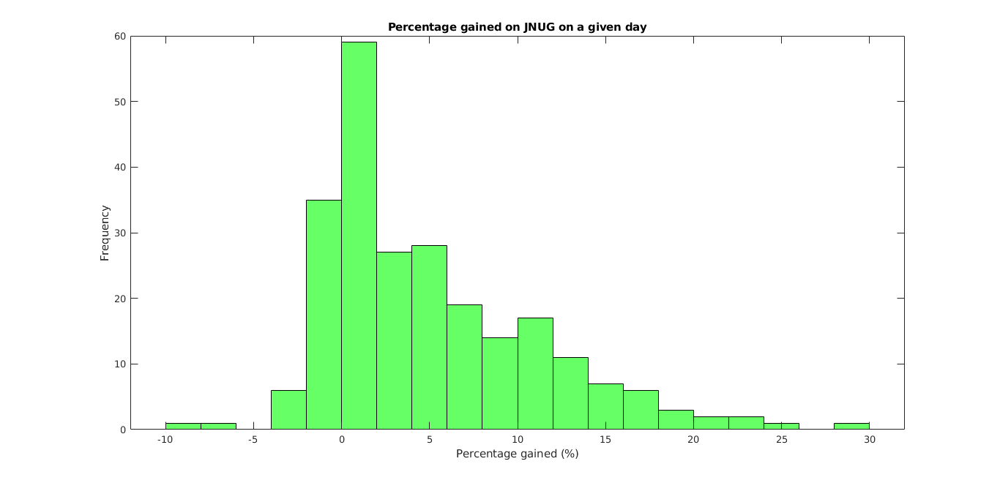

# Stock Market Prediction
Predicting the stock market using MATLAB and linear regression

Using the opening price, high price, and low price of a stock over two weeks, as well as the current stock opening price, this model predicts the closing price of that stock with about 80% accuracy.

[Full Report Here](https://docs.google.com/document/d/1L3u5gKNvpuLp4S4-yjCEbRjHrwH91EEyRn_v-18-4_s/edit?usp=sharing)

## File Structure
The `data/` folder stores csv files in the form <TICKER>.mat which include historical data for each stock.\
This folder also has a shell script to import this from Yahoo Finance (Copyright (c) 2017 Brad Lucas, MIT License)
  
The `models/` folder stores mat files (MATLAB workspace) with output data from the code.

The `output/` folder stores output data in text files.

The root `/` directory has the main matlab script and that script's dependency functions (function files in MATLAB).

## Statistics

